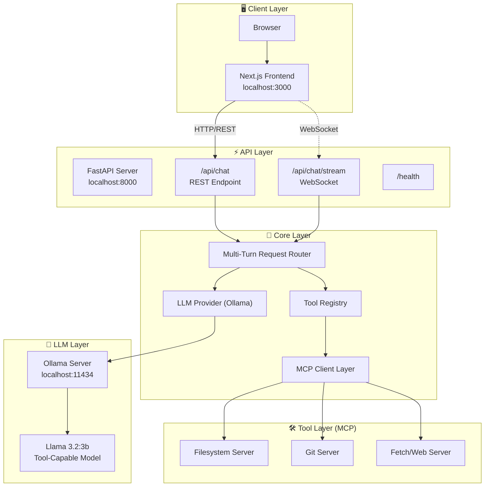
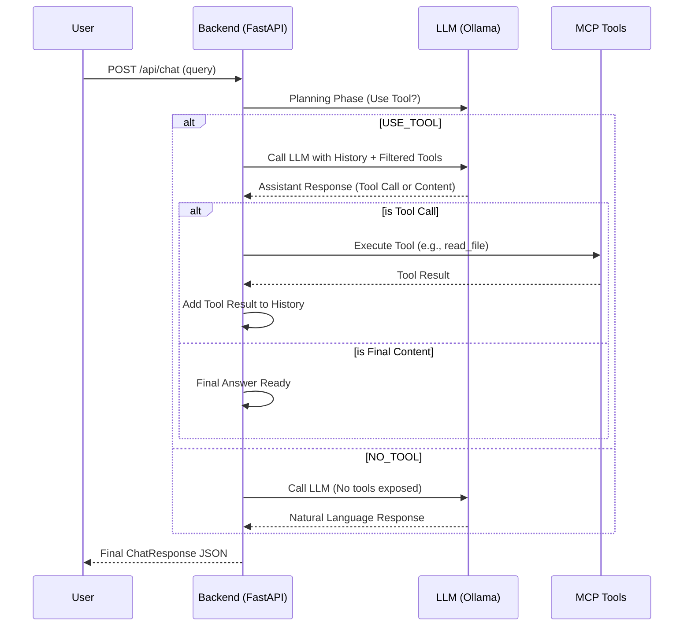
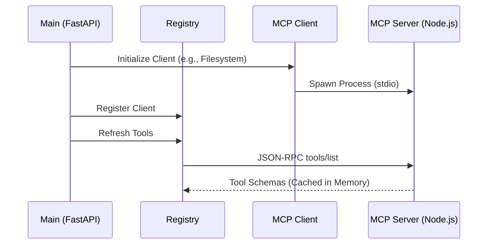
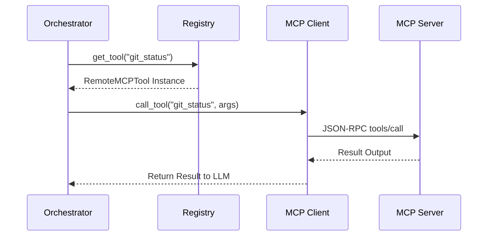
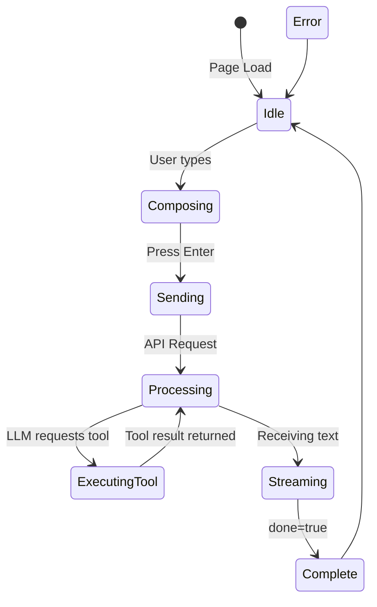
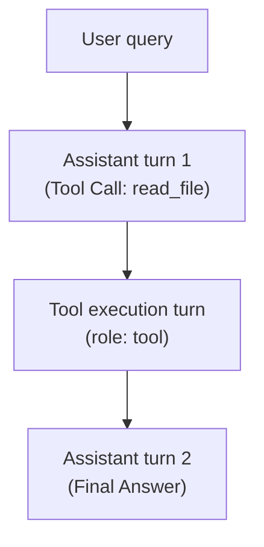

# Chatbot AI System

A production-grade, multi-tenant AI chatbot platform with multi-provider LLM support, WebSocket streaming, and modern UI.

## 🚀 Quick Start

### Prerequisites

- **Python 3.11+** with Poetry
- **Node.js 20+** with npm
- **Ollama** (for local LLM) - [Install Ollama](https://ollama.ai/)

### 1. Setup Environment

```bash
# Clone and navigate to project
cd /Users/mk/Documents/chatbot-ai-systems-production

# Copy environment files
cp .env.example .env
cp frontend/.env.example frontend/.env.local
```

### 2. Install Ollama and Tool Model

```bash
# Install Ollama (macOS)
brew install ollama

# Start Ollama service
ollama serve

# Pull Qwen 2.5 14B (Required for Decision Discipline)
ollama pull qwen2.5:14b-instruct
```

### 3. Start Backend

```bash
# Install Python dependencies
poetry install

# Start the backend server
poetry run uvicorn chatbot_ai_system.server.main:app --reload --host 0.0.0.0 --port 8000
```

### 4. Start Frontend

```bash
# Navigate to frontend
cd frontend

# Install dependencies
npm install

# Start development server
npm run dev
```

### 5. Access the Application

- **Frontend**: http://localhost:3000
- **API Docs**: http://localhost:8000/docs
- **Health Check**: http://localhost:8000/health

---

## 🏗️ System Design

### High-Level Architecture



### Request Flow (with Multi-Turn Tools)



### MCP Integration Flow

The system uses the Model Context Protocol (MCP) to connect the LLM with external tools safe and effectively.

#### 1. Startup: Tool Discovery
When the server boots, it connects to local MCP servers to load tool schemas.



#### 2. Runtime: Tool Execution
When the Orchestrator decides a tool call is needed:





#### Step-by-Step Flow

| Step | Component | Action | Details |
|------|-----------|--------|---------|
| 1 | **Frontend** | User submits query | Message sent to `/api/chat` |
| 2 | **Backend** | Tool Discovery | registry fetches tools from MCP servers |
| 3 | **Backend** | Planning Phase | Ask LLM: "USE_TOOL" or "NO_TOOL"? |
| 4 | **Backend** | Tool Filtering | If USE_TOOL, filter tools by keywords |
| 5 | **Backend** | LLM Call (Turn N) | Passes history + **Filtered Tools (Max 5)** |
| 6 | **Ollama** | Model Inference | Model executes tool call (Strict JSON) |
| 7 | **Backend** | Tool Execution | If tool requested, run via MCP Client |
| 8 | **Backend** | Context Update | Append Assistant JSON + Tool Result (with `tool_call_id`) |
| 9 | **Backend** | Final Answer | Loop breaks when LLM returns text instead of JSON |
| 10 | **Frontend** | Display | Final response rendered in UI |

#### Data Structures

```typescript
// Chat Message with Tool Support
interface ChatMessage {
  role: 'user' | 'assistant' | 'tool' | 'system'
  content: string
  tool_calls?: ToolCall[]   // Present in assistant role
  tool_call_id?: string     // Present in tool role
  timestamp: string
}

interface ToolCall {
  id: string
  type: 'function'
  function: {
    name: string
    arguments: object
  }
}

interface StreamChunk {
  content: string
  status?: string           // Real-time activity (e.g. "Thinking: read_file...")
  done: boolean
  tool_calls?: ToolCall[]
  conversation_id?: string
}

// Backend Response
interface ChatResponse {
  message: ChatMessage
  conversation_id: string
  model: string
  provider: string
  latency_ms: number
  usage: { prompt_tokens, completion_tokens }
}
```

### Conversation Context & Tool Turn Flow

This section explains how context is managed during multi-turn tool execution.

#### Tool Context Flow



#### What the Model Sees - Multi-Turn Example

**Turn 1: Initial Query**
```json
[
  {"role": "system", "content": "You are a helpful assistant..."},
  {"role": "user", "content": "What's in README.md?"}
]
```

**Turn 2: Tool Request (from AI)**
*Internal State: Backend receives tool request*
```json
[
  {"role": "system", "content": "..."},
  {"role": "user", "content": "What's in README.md?"},
  {"role": "assistant", "content": "", "tool_calls": [{"id": "call_123", "function": {"name": "read_file", ...}}]}
]
```

**Turn 3: Tool Result Injection**
*Backend appends the tool output to history*
```json
[
  {"role": "system", "content": "..."},
  {"role": "user", "content": "What's in README.md?"},
  {"role": "assistant", "content": "", "tool_calls": [{"id": "call_123", ...}]},
  {"role": "tool", "content": "# Project Title...", "tool_call_id": "call_123"}
]
```
Model receives: **4 messages** and now has the file content to answer the user.

#### Backend Processing for Tools

| Step | Component | Action |
|------|-----------|--------|
| 1 | `routes.py` | Add user message to history |
| 2 | `ollama.py` | Call LLM with current history |
| 3 | `ollama.py` | Parse JSON tool calls if model outputs raw text |
| 4 | `routes.py` | If `tool_calls` present: execute via `registry.execute_tool` |
| 5 | `routes.py` | Add `role: tool` message to history with result |
| 6 | `routes.py` | Re-call LLM (Step 2) for final answer |

#### Backend Processing Steps

| Step | Code Location | What Happens | Data State |
|------|---------------|--------------|------------|
| 1 | `routes.py:85` | Get/create conversation_id | `"abc-123"` |
| 2 | `routes.py:86-87` | Initialize empty list if new | `_conversations["abc-123"] = []` |
| 3 | `routes.py:90-92` | Append new user messages | Add to history |
| 4 | `routes.py:96` | Get ALL messages for context | `all_messages = _conversations["abc-123"]` |
| 5 | `routes.py:98-103` | Send to LLM provider | **Model sees full history** |
| 6 | `ollama.py:92-99` | Format for Ollama API | Convert to `[{role, content}]` |
| 7 | `ollama.py:105` | POST to Ollama | Inference with context |
| 8 | `routes.py:106` | Append AI response | Store assistant message |

#### Key Points

> [!IMPORTANT]
> **Context Window**: The model sees the **entire conversation history** on every turn. This allows it to:
> - Remember previous questions
> - Maintain conversation continuity
> - Reference earlier topics
> - Build on previous answers

> [!NOTE]
> **Phase 1 Limitation**: Conversation history is stored **in-memory only**. If the server restarts, all conversations are lost. Phase 2 will add PostgreSQL persistence.

> [!TIP]
> **Token Efficiency**: Currently, no token limit is enforced. In production, you should:
> - Limit conversation history length
> - Implement sliding window (e.g., last 10 messages)
> - Use summarization for very long conversations


### Component Structure

```
├── src/chatbot_ai_system/    # Backend application
│   ├── server/               # FastAPI app and multi-turn routes
│   ├── providers/            # LLM providers (Ollama with JSON parsing)
│   ├── models/               # Pydantic schemas (tool_call_id supported)
│   ├── tools/                # MCP Tool implementation & registry
│   └── config/               # Configuration management
├── scripts/                  # Validation & benchmarking scripts
├── phase_1.1.md              # Detailed Optimization Report
├── phase_1.2.md              # Decision Discipline Report
├── phase_1.3.md              # Chat Orchestrator Documentation
├── frontend/                 # Next.js frontend
└── tests/                    # Test suites
```

---

## 📡 API Endpoints

| Endpoint | Method | Description |
|----------|--------|-------------|
| `/health` | GET | Health check |
| `/api/chat` | POST | Send message and get response |
| `/api/chat/stream` | WebSocket | Streaming chat responses |
| `/api/conversations` | GET | List conversations |
| `/api/conversations/{id}` | GET | Get conversation messages |

---

## ⚙️ Configuration

Key environment variables (`.env`):

```env
# LLM Provider
DEFAULT_LLM_PROVIDER=ollama
OLLAMA_BASE_URL=http://localhost:11434
OLLAMA_MODEL=qwen2.5:14b-instruct

# MCP Servers (Configured in registry.py)
MCP_FS_ENABLE=true
MCP_GIT_ENABLE=true
MCP_FETCH_ENABLE=true
```

---

## 🛠️ Technology Stack

### Backend
- **FastAPI** - Modern Python web framework
- **Model Context Protocol (MCP)** - Standard for connecting LLMs to tools
- **Ollama** - Local LLM inference
- **Pydantic** - Data validation
- **WebSockets** - Real-time streaming

### Frontend
- **Next.js 14** - React framework
- **TypeScript** - Type safety
- **Tailwind CSS** - Styling

---

## 📈 Roadmap

- [x] **Phase 1**: Core Chatbot with Open Source LLM
- [x] **Phase 1.1**: MCP Tool Support & Streaming Execution
- [x] **Phase 1.2**: Decision Discipline (Smart Routing & Planning)
- [x] **Phase 1.3**: Chat Orchestrator (9-Phase Architecture)
- [ ] **Phase 2**: Data Persistence & User Memory (PostgreSQL)
- [ ] **Phase 3**: Multi-Provider Orchestration (OpenAI/Anthropic)
- [ ] **Phase 4**: Semantic Caching
- [ ] **Phase 5**: Authentication & Multi-Tenancy
- [ ] **Phase 6**: Observability & Prompt Tracing
- [ ] **Phase 7**: Infrastructure & Deployment (Docker/K8s)

---

## 📝 License

MIT License