# Chatbot AI System

A production-grade, multi-tenant AI chatbot platform with multi-provider LLM support, WebSocket streaming, and modern UI.

## 🚀 Quick Start

### Prerequisites

- **Python 3.11+** with Poetry
- **Node.js 20+** with npm
- **Ollama** (for local LLM) - [Install Ollama](https://ollama.ai/)

### 1. Setup Environment

```bash
# Clone and navigate to project
cd /Users/mk/Documents/chatbot-ai-systems-production

# Copy environment files
cp .env.example .env
cp frontend/.env.example frontend/.env.local
```

### 2. Install Ollama and Pull a Model

```bash
# Install Ollama (macOS)
brew install ollama

# Start Ollama service
ollama serve

# Pull a model (in another terminal)
ollama pull llama2
# Or use mistral for better performance
# ollama pull mistral
```

### 3. Start Backend

```bash
# Install Python dependencies
poetry install

# Start the backend server
poetry run uvicorn chatbot_ai_system.server.main:app --reload --host 0.0.0.0 --port 8000
```

### 4. Start Frontend

```bash
# Navigate to frontend
cd frontend

# Install dependencies
npm install

# Start development server
npm run dev
```

### 5. Access the Application

- **Frontend**: http://localhost:3000
- **API Docs**: http://localhost:8000/docs
- **Health Check**: http://localhost:8000/health

---

## 🏗️ System Design

### High-Level Architecture

```mermaid
flowchart TB
    subgraph Client["🖥️ Client Layer"]
        Browser["Browser"]
        UI["Next.js Frontend<br/>localhost:3000"]
    end
    
    subgraph API["⚡ API Layer"]
        FastAPI["FastAPI Server<br/>localhost:8000"]
        REST["/api/chat<br/>REST Endpoint"]
        WS["/api/chat/stream<br/>WebSocket"]
        Health["/health"]
    end
    
    subgraph Core["🧠 Core Layer"]
        Router["Request Router"]
        Provider["LLM Provider<br/>Abstraction"]
        ConvMgr["Conversation<br/>Manager"]
    end
    
    subgraph LLM["🤖 LLM Layer"]
        Ollama["Ollama Server<br/>localhost:11434"]
        Model["Gemma 3:4b<br/>Local Model"]
    end
    
    Browser --> UI
    UI -->|HTTP/REST| REST
    UI -.->|WebSocket| WS
    REST --> Router
    WS --> Router
    Health --> FastAPI
    Router --> Provider
    Router --> ConvMgr
    Provider --> Ollama
    Ollama --> Model
```



### Request Flow


### Chat State Flow

When a user initiates a chat, here's the complete state flow:


#### Step-by-Step Flow

| Step | Component | Action | State Change |
|------|-----------|--------|--------------|
| 1 | **Frontend** | User types in input field | `Idle` → `Composing` |
| 2 | **Frontend** | User presses Enter | `Composing` → `Sending` |
| 3 | **Frontend** | Add user message to UI | Display immediately |
| 4 | **Frontend** | Send POST to `/api/chat` | `Sending` → `Processing` |
| 5 | **Backend** | Receive ChatRequest | Validate with Pydantic |
| 6 | **Backend** | Get/create conversation ID | In-memory store lookup |
| 7 | **Backend** | Append message to history | Update `_conversations` dict |
| 8 | **Backend** | Call LLM provider | `provider.complete()` |
| 9 | **Ollama** | Process with Gemma 3 | ~2-5 second inference |
| 10 | **Backend** | Append AI response to history | Store assistant message |
| 11 | **Backend** | Return ChatResponse | JSON with message + metadata |
| 12 | **Frontend** | Parse response | Extract `data.message.content` |
| 13 | **Frontend** | Add AI message to UI | `Processing` → `Complete` |
| 14 | **Frontend** | Reset input state | `Complete` → `Idle` |

#### Data Structures

```typescript
// Frontend Message State
interface Message {
  id: string           // Unique message ID
  role: 'user' | 'assistant'
  content: string      // Message text
  timestamp: Date
}

// Backend Request
interface ChatRequest {
  messages: ChatMessage[]
  conversation_id?: string
  model?: string       // Default: gemma3:4b
  temperature?: number // Default: 0.7
}

// Backend Response
interface ChatResponse {
  message: ChatMessage
  conversation_id: string
  model: string
  provider: string
  latency_ms: number
  usage: { prompt_tokens, completion_tokens }
}
```


### Conversation Context & Memory Flow

This section explains how conversation history is managed and what data the LLM model sees at each turn.

#### Memory Storage (In-Memory - Phase 1)

```python
# Backend: routes.py
_conversations: Dict[str, List[ChatMessage]] = {}

# Example state after 2 turns:
{
  "abc-123": [
    ChatMessage(role="user", content="Hello! What's your name?"),
    ChatMessage(role="assistant", content="Hello there! My name is Gemma..."),
    ChatMessage(role="user", content="What is 25 times 4?"),
    ChatMessage(role="assistant", content="25 times 4 is 100!")
  ]
}
```

#### Context Flow Diagram


#### What the Model Sees - Example

**Turn 1:**
```json
POST /api/chat
{
  "messages": [
    {"role": "user", "content": "Hello! What's your name?"}
  ]
}
```
Model receives: **1 message** (just the user's question)

**Turn 2:**
```json
POST /api/chat
{
  "messages": [
    {"role": "user", "content": "Hello! What's your name?"},
    {"role": "assistant", "content": "Hello there! My name is Gemma..."},
    {"role": "user", "content": "What is 25 times 4?"}
  ],
  "conversation_id": "abc-123"
}
```
Model receives: **3 messages** (full conversation history for context)

**Turn 3:**
```json
POST /api/chat
{
  "messages": [
    {"role": "user", "content": "Hello! What's your name?"},
    {"role": "assistant", "content": "Hello there! My name is Gemma..."},
    {"role": "user", "content": "What is 25 times 4?"},
    {"role": "assistant", "content": "25 times 4 is 100!"},
    {"role": "user", "content": "Thanks!"}
  ],
  "conversation_id": "abc-123"
}
```
Model receives: **5 messages** (entire conversation thread)

#### Backend Processing Steps

| Step | Code Location | What Happens | Data State |
|------|---------------|--------------|------------|
| 1 | `routes.py:85` | Get/create conversation_id | `"abc-123"` |
| 2 | `routes.py:86-87` | Initialize empty list if new | `_conversations["abc-123"] = []` |
| 3 | `routes.py:90-92` | Append new user messages | Add to history |
| 4 | `routes.py:96` | Get ALL messages for context | `all_messages = _conversations["abc-123"]` |
| 5 | `routes.py:98-103` | Send to LLM provider | **Model sees full history** |
| 6 | `ollama.py:92-99` | Format for Ollama API | Convert to `[{role, content}]` |
| 7 | `ollama.py:105` | POST to Ollama | Inference with context |
| 8 | `routes.py:106` | Append AI response | Store assistant message |

#### Key Points

> [!IMPORTANT]
> **Context Window**: The model sees the **entire conversation history** on every turn. This allows it to:
> - Remember previous questions
> - Maintain conversation continuity
> - Reference earlier topics
> - Build on previous answers

> [!NOTE]
> **Phase 1 Limitation**: Conversation history is stored **in-memory only**. If the server restarts, all conversations are lost. Phase 2 will add PostgreSQL persistence.

> [!TIP]
> **Token Efficiency**: Currently, no token limit is enforced. In production, you should:
> - Limit conversation history length
> - Implement sliding window (e.g., last 10 messages)
> - Use summarization for very long conversations


### Component Structure

```
├── src/chatbot_ai_system/    # Backend application
│   ├── server/               # FastAPI app and routes
│   ├── providers/            # LLM provider implementations
│   ├── models/               # Pydantic schemas
│   └── config/               # Configuration management
├── frontend/                 # Next.js frontend
│   ├── app/                  # Next.js 14 app directory
│   └── components/           # React components
└── tests/                    # Test suites
```

---

## 📡 API Endpoints

| Endpoint | Method | Description |
|----------|--------|-------------|
| `/health` | GET | Health check |
| `/api/chat` | POST | Send message and get response |
| `/api/chat/stream` | WebSocket | Streaming chat responses |
| `/api/conversations` | GET | List conversations |
| `/api/conversations/{id}` | GET | Get conversation messages |

---

## ⚙️ Configuration

Key environment variables (`.env`):

```env
# LLM Provider
DEFAULT_LLM_PROVIDER=ollama
OLLAMA_BASE_URL=http://localhost:11434
OLLAMA_MODEL=llama2

# Server
HOST=0.0.0.0
PORT=8000
DEBUG=true
```

---

## 🛠️ Technology Stack

### Backend
- **FastAPI** - Modern Python web framework
- **Ollama** - Local LLM inference
- **Pydantic** - Data validation
- **WebSockets** - Real-time streaming

### Frontend
- **Next.js 14** - React framework
- **TypeScript** - Type safety
- **Tailwind CSS** - Styling
- **WebSocket API** - Real-time updates

---

## 📈 Roadmap

- [x] **Phase 1**: Core Chatbot with Open Source LLM
- [x] **Phase 1.1**: MCP Tool Support (Ollama)
- [ ] **Phase 2**: Data Persistence & Memory Module
- [ ] **Phase 3**: Multi-Provider Orchestration
- [ ] **Phase 4**: Semantic Caching
- [ ] **Phase 5**: Authentication & Multi-Tenancy
- [ ] **Phase 6**: Observability Stack
- [ ] **Phase 7**: Infrastructure & Deployment

---

## 📝 License

MIT License