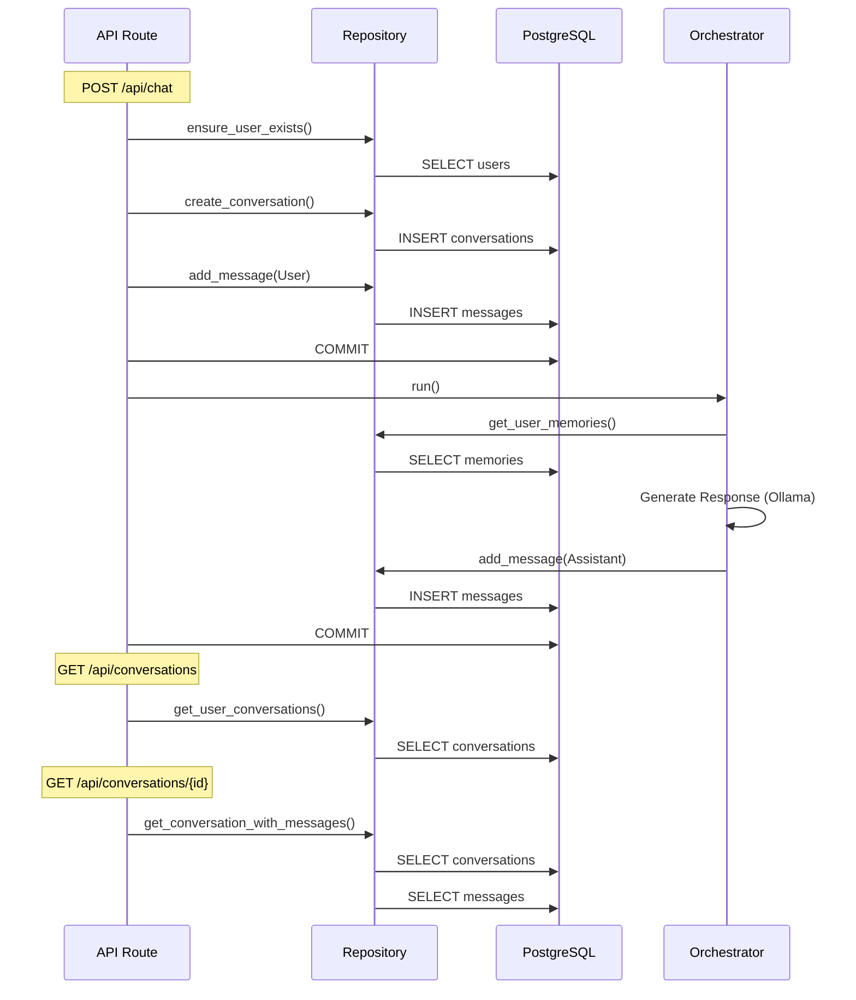

# Database Flow Analysis Report

## 1. Test Overview
We validated the system's database persistence by running a complete end-to-end chat flow while capturing raw SQL queries generated by SQLAlchemy.

**Test Scenario:** `scripts/validate_db_flow.py`
1.  **Health Check**: Verifies system status.
2.  **Send Message**: "Explain quantum physics in one sentence." (Triggers user creation, conversation creation, message persistence, and LLM inference).
3.  **List Conversations**: Verifies conversation metadata retrieval.
4.  **Get History**: Verifies full message history retrieval.

## 2. SQL Query Log Analysis

The following sequence of database operations was observed during the test execution.

### Phase 1: Request Processing (`POST /api/chat`)

**Step 1: User & Conversation Validation**
*   **Action**: Check if user exists.
*   **Component**: `routes.py` -> `ensure_user_exists`
*   **SQL**:
    ```sql
    SELECT users.id, ... FROM users WHERE users.id = $1::UUID
    ```

**Step 2: Conversation Creation**
*   **Action**: Create new conversation record.
*   **Component**: `routes.py` -> `ConversationRepository.create_conversation`
*   **SQL**:
    ```sql
    INSERT INTO conversations (id, user_id, title, is_archived, created_at, updated_at) 
    VALUES ($1::UUID, $2::UUID, $3::VARCHAR, $4::BOOLEAN, $5::TIMESTAMP, $6::TIMESTAMP)
    ```

**Step 3: User Message Persistence**
*   **Action**: Save the incoming user message.
*   **Component**: `routes.py` -> `ConversationRepository.add_message`
*   **SQL**:
    ```sql
    INSERT INTO messages (id, conversation_id, role, content, sequence_number, ...) 
    VALUES (..., 'user', 'Explain quantum physics...', 1, ...)
    ```
*   **Commit**: `COMMIT` (Ensures user message is saved before generation starts).

### Phase 2: Orchestration & Generation

**Step 4: Context Retrieval (Memory)**
*   **Action**: Fetch long-term memories to inject into system prompt.
*   **Component**: `ChatOrchestrator.run` -> `MemoryRepository.get_user_memories`
*   **SQL**:
    ```sql
    SELECT memories.id, ... FROM memories WHERE memories.user_id = $1::UUID
    ```

**Step 5: LLM Generation**
*   **Action**: Call Ollama API (External).
*   **Log**: `Ollama response content: ...`

**Step 6: Assistant Message Persistence**
*   **Action**: Save the generated response.
*   **Component**: `ChatOrchestrator` -> `ConversationRepository.add_message` (called internally, committed by route)
*   **SQL**:
    ```sql
    INSERT INTO messages (id, conversation_id, role, content, sequence_number, ...) 
    VALUES (..., 'assistant', 'Quantum physics is a fundamental theory...', 2, ...)
    ```
*   **Commit**: `COMMIT` (Finalizes the transaction after successful response).

### Phase 3: Retrieval (`GET /api/conversations`)

**Step 7: List Conversations**
*   **Action**: Fetch user's conversations.
*   **Component**: `routes.py` -> `ConversationRepository.get_user_conversations`
*   **SQL**:
    ```sql
    SELECT conversations.id, ... FROM conversations 
    WHERE conversations.user_id = $1::UUID 
    ORDER BY conversations.updated_at DESC LIMIT 50
    ```

### Phase 4: History Retrieval (`GET /api/conversations/{id}`)

**Step 8: Load Conversation & Messages**
*   **Action**: Fetch conversation metadata and associated messages.
*   **Component**: `routes.py` -> `ConversationRepository.get_conversation_with_messages`
*   **SQL**:
    ```sql
    SELECT conversations.id, ... FROM conversations WHERE conversations.id = $1::UUID
    SELECT messages.id, ... FROM messages WHERE messages.conversation_id IN ($1::UUID) ORDER BY messages.sequence_number
    ```
    *(Note: SQLAlchemy uses efficient batched selection here).*

## 3. Component Interaction Flow



## 4. Conclusion
The system correctly implements the intended data flow:
1.  **Atomicity**: User messages are committed *before* generation, ensuring we capture the query even if the generation fails.
2.  **Persistence**: Assistant responses are inserted and committed after generation.
3.  **Efficiency**: Repositories reuse the same database session, allowing for coherent transactions (though we explicitly commit in stages for safety).
4.  **Correctness**: The SQL logs verify that all expected tables (`users`, `conversations`, `messages`, `memories`) are accessed in the correct order.
