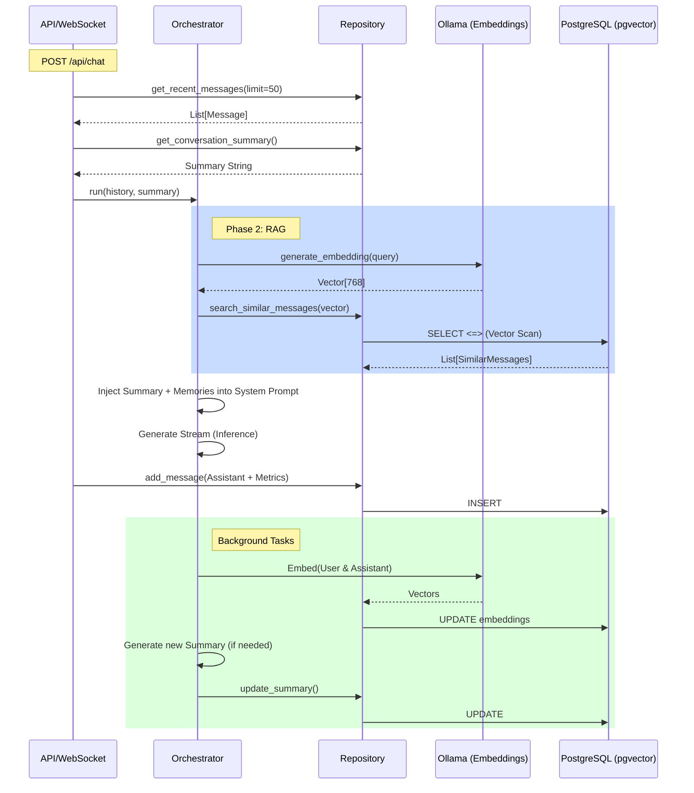

# Database Flow Analysis Report (v2.5)

## 1. Test Overview
We validated the complete 3-layer memory architecture by tracing the data flow from initial user message to final assistant response, including vector embeddings and summarization triggers.

---

## 2. SQL Query & Component Flow

### Step 1: User Message & History (REST/WS Route)
*   **Action**: Fetch recent history (Sliding Window).
*   **SQL**:
    ```sql
    SELECT * FROM messages 
    WHERE conversation_id = $1 
    ORDER BY sequence_number DESC LIMIT 50;
    ```
*   **Action**: Fetch existing summary (Warm Memory).
*   **SQL**:
    ```sql
    SELECT summary, last_summarized_seq_id FROM conversations WHERE id = $1;
    ```
*   **Action**: Save new user message.
*   **Phase**: 1
*   **SQL**:
    ```sql
    INSERT INTO messages (conversation_id, role, content, sequence_number, ...) 
    VALUES ($1, 'user', 'Who is the space whale?', 51, ...);
    ```

### Step 2: Semantic Retrieval (Orchestrator - Phase 2)
*   **Action**: Generate embedding for user message (Ollama: `nomic-embed-text`).
*   **Action**: Search for similar past messages (Cold Memory).
*   **SQL**:
    ```sql
    SELECT messages.* FROM messages 
    JOIN conversations ON messages.conversation_id = conversations.id
    WHERE conversations.user_id = $1 
    ORDER BY messages.embedding <=> $2 
    LIMIT 5; -- Cosine distance search
    ```

### Step 3: LLM Inference & Persistence (Phase 8)
*   **Action**: Prompt LLM with [Summary + Retrieved Memories + Sliding Window History].
*   **Action**: Save assistant response with metrics.
*   **SQL**:
    ```sql
    INSERT INTO messages (role, content, token_count_prompt, latency_ms, model, ...) 
    VALUES ('assistant', 'The space whale is...', 450, 1200, 'qwen2.5:14b', ...);
    ```

### Step 4: Background Processes (Phase 9)
*   **Action**: Update message with vector embedding.
*   **SQL**:
    ```sql
    UPDATE messages SET embedding = $1 WHERE id = $2;
    ```
*   **Action**: Trigger summarization (if threshold 20 crossed).
*   **SQL**:
    ```sql
    UPDATE conversations SET summary = $1, last_summarized_seq_id = $2 WHERE id = $3;
    ```

---

## 3. Component Interaction Flow (Infini-Memory)



---

## 4. Conclusion
The v2.5 data flow maximizes memory efficiency:
1.  **Low Latency**: Immediate status is small (Sliding Window).
2.  **High Recall**: Background embeddings ensure every word is findable later.
3.  **Low Cost**: Summarization reduces total token count in long-running threads.
4.  **Observable**: Latency and tokens are tracked per-turn in the final DB persistence.
