# Phase 5.0: Multimodal Input & Voice Conversation

This phase transforms the chatbot from a text-only system into a multimodal AI assistant capable of understanding images, transcribing audio, processing video, and holding real-time voice conversations.

## 🎯 Objectives

- Accept image uploads and describe/analyze them using a vision model (`llava:7b`).
- Accept audio uploads, transcribe them via Whisper STT, and respond in context.
- Accept video uploads, extract keyframes and audio transcript.
- Provide a real-time voice conversation endpoint over WebSocket (STT → LLM → TTS).
- Auto-detect media type and route to the appropriate model without manual user configuration.
- Maintain full backward compatibility — text-only chats are unaffected.

---

## 🏗️ Architecture

### Data Flow

```mermaid
flowchart LR
    subgraph Upload["POST /api/upload"]
        File["File Upload"]
    end

    subgraph Pipeline["MediaPipeline"]
        Validate["Validate\n(type, size)"]
        ImgProc["Image:\nResize → Base64"]
        AudProc["Audio:\nConvert → Whisper STT"]
        VidProc["Video:\nKeyframes + STT"]
    end

    subgraph Chat["Chat Flow"]
        Attach["ChatMessage\n.attachments"]
        Orch["Orchestrator"]
        Detect["Detect media type"]
        Switch["Auto-switch model"]
    end

    subgraph Models["LLM Models"]
        Vision["llava:7b\n(Vision)"]
        Text["qwen2.5:14b\n(Text)"]
    end

    File --> Validate --> ImgProc & AudProc & VidProc
    ImgProc --> Attach
    AudProc -->|transcription injected| Attach
    VidProc -->|keyframes + transcript| Attach
    Attach --> Orch --> Detect
    Detect -->|has images| Switch --> Vision
    Detect -->|text only| Text
```



### Voice Conversation Flow


---

## 📁 Files Created

| File | Description |
|------|-------------|
| `services/media_pipeline.py` | Core media processing: image resize/base64, audio STT via faster-whisper, video keyframe extraction via OpenCV |
| `services/stt_engine.py` | Speech-to-text engine wrapping faster-whisper with lazy model loading and streaming support |
| `services/tts_engine.py` | Text-to-speech with auto-detected backend (piper-tts, macOS `say`, espeak-ng) and streaming |
| `server/multimodal_routes.py` | API routes: `POST /api/upload`, `GET /api/voice/config`, `WS /api/voice/stream` |
| `scripts/test_multimodal.py` | 8-test end-to-end verification suite |
| `alembic/versions/0cd94ce50f5b_*.py` | DB migration for `media_attachments` table |

## 📁 Files Modified

| File | Changes |
|------|---------|
| `models/schemas.py` | Added `MediaAttachment` Pydantic model with fields: `type`, `url`, `base64_data`, `mime_type`, `filename`, `duration_seconds`, `transcription`, `width`, `height`. Added `attachments: Optional[List[MediaAttachment]]` to `ChatMessage`. Fixed duplicate fields in `StreamChunk`. |
| `database/models.py` | Added `MediaAttachment` SQLAlchemy model with FK to `messages`. Columns: `id`, `message_id`, `type`, `url`, `mime_type`, `filename`, `file_size_bytes`, `duration_seconds`, `width`, `height`, `created_at`. |
| `config/settings.py` | Added: `media_storage_path`, `max_upload_size_mb`, `supported_image_types`, `supported_audio_types`, `supported_video_types`, `stt_model`, `stt_device`, `tts_voice`, `vision_model`. |
| `providers/ollama.py` | `_format_messages()` now extracts base64 image data from attachments and includes it as `images[]` in the Ollama API payload for vision models. |
| `orchestrator.py` | Added multimodal detection in `run()`: scans for image/audio/video attachments, auto-switches to `vision_model` when images detected, injects audio transcriptions into message content. Updated `_classify_intent()` to bypass LLM classifier when media is present. |
| `server/main.py` | Registered `multimodal_router` for upload and voice endpoints. |

---

## 🔧 New API Endpoints

### `POST /api/upload`

Upload a media file for processing. Returns processed metadata.

**Request:** `multipart/form-data` with `file` field.

**Response:**
```json
{
  "id": "uuid",
  "type": "image",
  "filename": "photo.png",
  "mime_type": "image/png",
  "file_path": "media/images/abc123.png",
  "file_size_bytes": 1024,
  "base64_data": "iVBORw0KGgo...",
  "width": 512,
  "height": 384
}
```

For audio uploads, the response includes `transcription` and `duration_seconds` instead of image-specific fields.

**Supported Types:**
- Images: `png`, `jpg`, `jpeg`, `gif`, `webp`
- Audio: `wav`, `mp3`, `ogg`, `m4a`, `webm`
- Video: `mp4`, `webm`, `mov`
- Max file size: 50 MB (configurable)

### `GET /api/voice/config`

Returns voice chat capability information.

```json
{
  "stt_available": true,
  "tts_available": true,
  "tts_backend": "macos_say",
  "stt_model": "base"
}
```

### `WS /api/voice/stream`

Full-duplex voice conversation over WebSocket.

**Protocol:**
| Direction | Format | Message |
|-----------|--------|---------|
| Client → Server | Binary | 16kHz 16-bit PCM mono audio frames |
| Client → Server | JSON | `{"type": "end_turn"}` to signal end of speech |
| Server → Client | JSON | `{"type": "transcription", "text": "...", "language": "en"}` |
| Server → Client | JSON | `{"type": "response_start"}` |
| Server → Client | JSON | `{"type": "response_text", "text": "..."}` |
| Server → Client | Binary | WAV audio response (64KB chunks) |
| Server → Client | JSON | `{"type": "response_end"}` |

---

## 🧠 Orchestrator Behavior

When the orchestrator receives a message with attachments, it:

1. **Scans attachments** for images, audio, and video.
2. **Images detected:** Automatically switches from the default text model to `llava:7b` (configurable via `VISION_MODEL` env var). The base64 image data is passed through the Ollama `images[]` API field.
3. **Audio/video detected:** If a transcription is present (from prior upload processing), it is injected into the message content with a `[Audio transcription]` or `[Video audio transcription]` prefix.
4. **Intent classification bypassed:** When media is present, the LLM-based intent classifier is skipped and the intent defaults to `GENERAL`, since the primary task is media understanding rather than tool routing.

---

## 🛠️ Technology Stack Additions

| Technology | Purpose | Notes |
|-----------|---------|-------|
| **faster-whisper** | Speech-to-text | OpenAI Whisper reimplementation, runs on CPU with int8 quantization |
| **Pillow** | Image processing | Resize, format conversion, base64 encoding |
| **pydub** | Audio conversion | Converts any format to 16kHz mono WAV (requires ffmpeg) |
| **opencv-python-headless** | Video processing | Keyframe extraction at fixed intervals |
| **ffmpeg** | Audio/video codec | System dependency for pydub and video processing |
| **llava:7b** | Vision model | Multimodal LLM for image understanding via Ollama |
| **macOS say / piper-tts / espeak** | Text-to-speech | Auto-detected TTS backend for voice responses |

---

## ⚙️ Configuration

New environment variables added to `.env`:

```env
# Phase 5.0: Multimodal & Voice
MEDIA_STORAGE_PATH=media           # Local directory for uploaded files
MAX_UPLOAD_SIZE_MB=50              # Maximum upload size
VISION_MODEL=llava:7b              # Vision-capable model for image analysis
STT_MODEL=base                     # Whisper model size (tiny/base/small/medium/large)
STT_DEVICE=cpu                     # Compute device (cpu/cuda)
TTS_VOICE=en_US-lessac-medium      # Piper TTS voice (if using piper backend)
```

---

## ✅ Verification Results

All 8 end-to-end tests passed:

| Test | Result | Details |
|------|--------|---------|
| Image Processing | ✅ | 3 sizes tested, auto-resize to 1024px max, file validation |
| Format Messages | ✅ | `images[]` included for vision, excluded for text-only |
| Vision Model | ✅ | llava:7b described a red circle as "resembling the flag of Japan" (3.9s) |
| Audio & STT | ✅ | Whisper model loaded, transcription pipeline functional |
| TTS Synthesis | ✅ | macOS `say` backend auto-detected, 902ms per sentence |
| Orchestrator Detection | ✅ | Auto-switches model, injects transcriptions correctly |
| Upload API | ✅ | `POST /api/upload` → 200 OK with base64 data |
| Voice Config | ✅ | `GET /api/voice/config` → capabilities returned |

Run the test suite:
```bash
python scripts/test_multimodal.py
```

---

## 📋 Completed Tasks

- [x] Schema updates: `MediaAttachment` Pydantic model and SQLAlchemy table
- [x] Image pipeline: resize, base64 encode, file storage
- [x] Audio pipeline: format conversion, Whisper STT
- [x] Video pipeline: keyframe extraction, audio transcription
- [x] Vision integration: Ollama `images[]` support in `_format_messages()`
- [x] Orchestrator: auto-detect media, switch model, inject transcriptions
- [x] Upload endpoint: `POST /api/upload` with validation
- [x] STT engine: faster-whisper with lazy loading
- [x] TTS engine: multi-backend with auto-detection
- [x] Voice WebSocket: real-time STT → LLM → TTS
- [x] DB migration: `media_attachments` table via Alembic
- [x] FFmpeg installed, llava:7b pulled, all 8 tests passing
