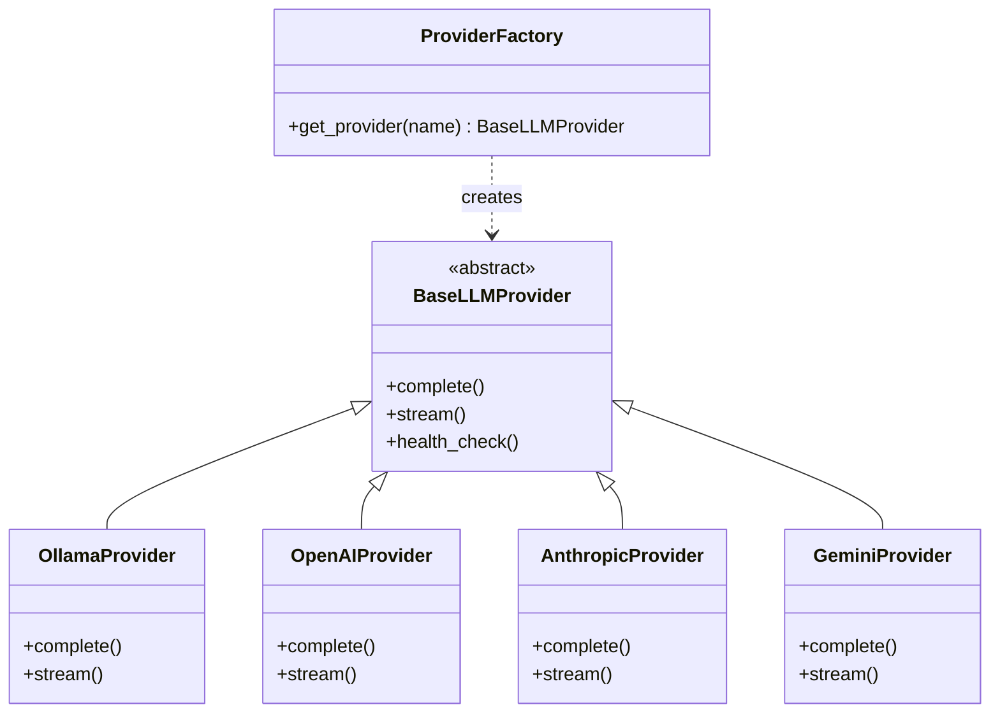

# Phase 6.0: Multi-Provider Orchestration

This phase introduces a flexible **Multi-Provider Architecture**, allowing the chatbot to seamlessly switch between local open-source models (Ollama) and cloud-based LLMs (OpenAI, Anthropic, Gemini).

## 🎯 Objectives

- **Hybrid AI**: Combine the privacy and cost-efficiency of local models with the reasoning power of frontier cloud models.
- **"Bring Your Own Key" (BYOK)**: Optional integration with OpenAI, Anthropic, and Google Gemini using standard API keys.
- **Zero-Dependency Cloud Support**: Implemented using lightweight `httpx` REST calls to avoid bloating the project with heavy SDKs.
- **Local Embeddings**: Decoupled embedding generation from chat, ensuring that RAG (memories) always remains local and private via `nomic-embed-text`.

---

## 🏗️ Architecture

### Provider Factory Pattern
We replaced the hardcoded `OllamaProvider` with a dynamic `ProviderFactory`.



### Hybrid Data Flow
1.  **Chat**: Routes to the configured provider (e.g., GPT-4o).
2.  **Memory/RAG**: Always routes to **Ollama** (`nomic-embed-text`) for vector embeddings.

---

## ⚙️ Configuration

To use a cloud provider, add the corresponding API key to your `.env` file. If a key is missing, the system will fallback or error gracefully when that provider is requested.

```env
# Default Provider (options: ollama, openai, anthropic, gemini)
DEFAULT_LLM_PROVIDER=ollama

# OpenAI (Optional)
OPENAI_API_KEY=sk-...
OPENAI_MODEL=gpt-4o-mini

# Anthropic (Optional)
ANTHROPIC_API_KEY=sk-ant-...
ANTHROPIC_MODEL=claude-3-5-sonnet-20240620

# Google Gemini (Optional)
GEMINI_API_KEY=AIza...
GEMINI_MODEL=gemini-1.5-flash
```

---

## 🚀 Usage

### Switching Providers
You can switch providers globally via `.env` or per-request (API support pending in Phase 7).

**Example: Switching to OpenAI**
1.  Set `DEFAULT_LLM_PROVIDER=openai` in `.env`.
2.  Restart the server.

### Verification
Run the verification script to check which providers are properly configured and accessible:

```bash
python scripts/verify_phase_6_0.py
```

**Sample Output:**
```
INFO:__main__:--- Testing Provider: ollama ---
INFO:__main__:Health check: True
INFO:__main__:Response: Test Successful
INFO:__main__:--- Testing Provider: openai ---
INFO:__main__:Skipping OpenAI test (No API Key)
...
```

---

## 📁 Files Created

| File | Description |
| :--- | :--- |
| `src/chatbot_ai_system/providers/factory.py` | Factory class for instantiating providers. |
| `src/chatbot_ai_system/providers/base.py` | Abstract base class defining the provider interface. |
| `src/chatbot_ai_system/providers/openai.py` | OpenAI implementation (REST API). |
| `src/chatbot_ai_system/providers/anthropic.py` | Anthropic implementation (REST API). |
| `src/chatbot_ai_system/providers/gemini.py` | Google Gemini implementation (REST API). |
| `scripts/verify_phase_6_0.py` | Verification script for multi-provider testing. |

## 📁 Files Modified

| File | Changes |
| :--- | :--- |
| `src/chatbot_ai_system/orchestrator.py` | Updated to use `ProviderFactory` and decoupled `EmbeddingService`. |
| `src/chatbot_ai_system/server/routes.py` | Updated `get_provider` helper to use the factory. |
| `src/chatbot_ai_system/config/settings.py` | Added configuration fields for new providers. |
| `pyproject.toml` | Checked dependencies (no new heavy SDKs added). |

---

## ✅ Results
- **Flexibility**: Users can now use SOTA cloud models for complex reasoning while keeping the system lightweight.
- **Privacy**: Embeddings and long-term memory remain strictly local.
- **Reliability**: The system defaults to Ollama if cloud keys are missing.
